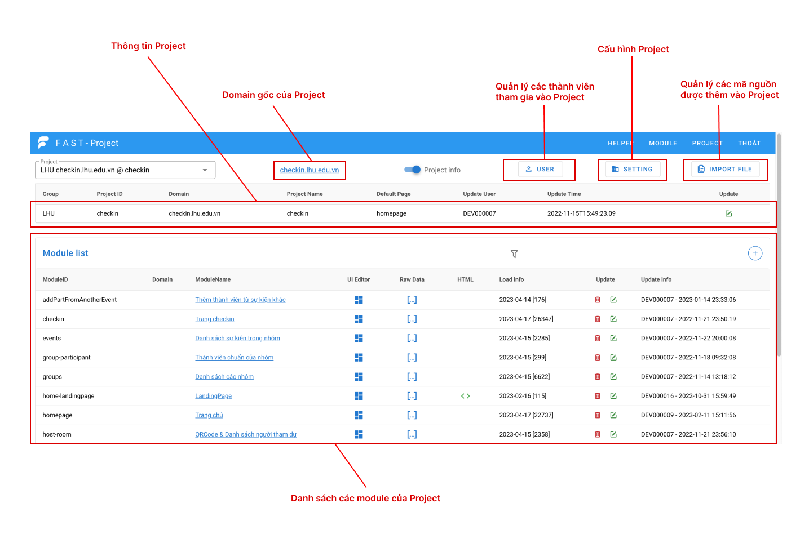

# Dự án

### Cấu trúc dự án

Một dự án FUI chứa nhiều module (trang) thực hiện một nhiệm vụ nhất định trong dự án. Các module có thể [tương tác dữ liệu và có quan hệ](broken-reference) với nhau.

<figure><figcaption></figcaption></figure>

### Cấu hình dự án

Để cấu hình dự án, bạn thực hiện các bước sau:

1. Ở màn hình dự án, nhấn vào nút &#x20;
2. Một cửa sổ mới được mở ra với cấu trúc cấu hình của dự án.
3. Tuỳ chỉnh các giá trị phù hợp của các thuộc tính theo diễn giải phía dưới.


Một cấu hình của project sẽ được áp dụng cho tất cả các module của nó. Ví dụ: thanh danh mục menu, địa chỉ API,.... sẽ được dùng chung với tất cả các module của nó.


Cấu hình của một project được định nghĩa có cấu trúc gồm những thuộc tính sau đây:

```json
{
  "ProjectName": "Tuyển sinh",
  "title": "Chương trình đại sứ",
  "apiDomain": "https://api.fui.vn/",
  "login": "https://login.fui.vn/",
  "menubgcolor": "indigo",
  "menucolor": "yellow--text",
  "logo": "https://fui.vn/images/fastUI_White.png",
  "userInfo": "https://api.fui.vn/acc/UserInfo",
  "menu": [
    {
      "name": "Giới thiệu",
      "url": "/gioi-thieu"
    },
    {
      "name": "Quản lý",
      "submenu": [
        {
          "name": "Danh sách đại sứ",
          "url": "/danhsach-daisu"
        },
        {
          "name": "Danh sách học sinh",
          "url": "/danhsach-hocsinh"
        }
      ]
    }
  ]
}
```

Diễn giải:

* **ProjectName**: Tên mô tả cho dự án.
* **title**: Tên tiêu đề cho dự án đó
* **apiDomain**: Địa chỉ API của dự án.
* **login**: Đường dẫn đến trang xác thực người dùng, nếu người dùng chưa xác thực, họ sẽ được chuyển đến trang đăng nhập.
* **menubgcolor**: Màu của thanh menu.
* **menucolor**: Màu chữ của thanh menu.
* **logo**: Địa chỉ url của logo hiển thị trên thanh menu.
* **userInfo**: API để lấy thông tin người dùng sau khi đã xác thực.
* **menu: M**ảng chứa cấu trúc của menu trong dự án.
  * **name**: Tên hiển thị trên thanh menu.
  * **url**: Địa chỉ của menu.
  * **submenu**: Chứa những mục con của menu.


Để ẩn thanh menu `"menu": false`

Chỉ ẩn menu vẫn hiển thị thanh`"menu": []`

Trang không cần đăng nhập `"login": false`


| Thuộc tính      | Kiểu dữ liệu    | Mô tả                                                                                                                                                                                                                                    |
| --------------- | --------------- | ---------------------------------------------------------------------------------------------------------------------------------------------------------------------------------------------------------------------------------------- |
| **ProjectName** | String          | Tên mô tả của project.                                                                                                                                                                                                                   |
| **title**       | String          | Tên tiều đề.                                                                                                                                                                                                                             |
| **apiDomain**   | String          | Địa chỉ API.                                                                                                                                                                                                                             |
| **login**       | String, Boolean | Trang xác thực người dùng của project, sẽ được chuyển đến nếu người dùng chưa xác thực.                                                                                                                                                  |
| **menubgcolor** | String          | Màu của thanh menu.                                                                                                                                                                                                                      |
| **menucolor**   | String          | Màu chữ của thanh menu.                                                                                                                                                                                                                  |
| **logo**        | String          | Địa chỉ url của logo hiển thị trên thanh menu.                                                                                                                                                                                           |
| **userInfo**    | String          | API để lấy thông tin người dùng sau khi đã xác thực.                                                                                                                                                                                     |
| **menu**        | Array, Boolean  | <p>Mảng chứa cấu trúc menu của project.<br>Trong đó:<br>   - <strong>name</strong>: Tên hiển thị trên thanh menu.<br>   - <strong>url</strong>: Địa chỉ của menu.<br>   - <strong>submenu</strong>: Chứa những mục con của menu.<br></p> |
